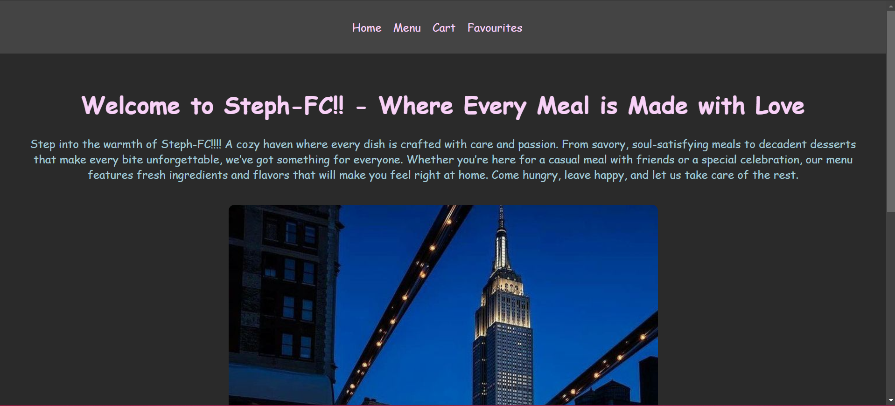

# Steph-FC Restaurant App

A simple and intuitive restaurant web application built using React JS, showcasing menu items, cart functionality, and favourites management for a better dining experience. The app allows users to explore a menu, add items to their cart and favourites, and manage them easily.

By: Stephanie Njonjo

## Description

Steph-FC is a restaurant web application that brings together a seamless experience for customers to browse a delicious menu, add their favorite items to a cart or favourites list, and manage their selections easily. The app features React JS for dynamic interactions and state management, and it makes use of React Router for navigation across pages.

With Steph-FC, users can:

- Browse the menu of available dishes.
- Add items to their cart.
- Save their favorite dishes to a favourites list for quick access.
- Easily remove items from both the cart and favourites list.

## Features

- Home Page: A welcoming page that introduces the restaurant and offers easy navigation to the menu, cart, and favourites pages.
- Menu: Displays a list of available food items with the ability to filter by name and add items to the cart or favourites.
- Cart: Allows users to view, manage, and remove items from their cart.
- Favourites: Lets users save their favorite dishes and easily remove them when desired.
- Search Functionality: Users can search for menu items by name.
- Alerts: Displays a confirmation alert when an item is added or removed from the cart or favourites.

Screenshot

## How to Use

## Requirements

- A computer, tablet, or phone
- Access to the internet
- A modern web browser (Chrome, Firefox, Safari)

## View Live Site 

Visit the live application at: Steph-FC Restaurant App

The live site allows you to: 
- Explore the Menu: Browse the available food items and search for specific dishes.
- Manage Your Cart: Add dishes to your cart and proceed to checkout when ready.
- Save Favourites: Add your favorite dishes to the Favourites page for easy access.
- Manage Favourites: Remove items from your favourites list with a click.

## Local Development
If you want to run the project locally, follow these steps:

- Node.js installed on your computer
- A basic understanding of React JS
- A code editor (VS Code recommended)
- Terminal or Command Line

### Installation Process

1. Clone this repository:
`git clone git@github.com:Stephanieest/phase-2-project.git`
or by downloading a ZIP file of the code.

2. Navigate to the project directory:
cd `phase-2-project`

3. Install the required dependecies: 
`npm install`

4. Run the development server:
`npm start`

5. Open your browser and visit http://localhost:3000 to view the app locally.

## Technologies Used

- React JS: For building the UI components and managing state.
- React Router: For navigation between different pages (Home, Menu, Cart, Favourites).
- CSS: For styling the components and layout.
- JavaScript: For dynamic functionality and state management.

## Related Repositories

Backend API: [Backend Repo] (https://github.com/Stephanieest/steph-fc-back-end)
Deployed API: [Deployed Backend] (https://steph-fc-back-end.onrender.com/)

## Support and Contact
For any questions, suggestions, or assistance, feel free to reach out:
Email: stephnjonjo@gmail.com

## License
MIT License

Copyright © 2024 Stephanie Njonjo

Permissions
Permission is hereby granted, free of charge, to any person obtaining a copy of this software and associated documentation files (the "Software"), to deal in the Software without restriction, including without limitation the rights to use, copy, modify, merge, publish, distribute, sublicense, and/or sell copies of the Software, and to permit persons to whom the Software is furnished to do so, subject to the following conditions:

The above copyright notice and this permission notice shall be included in all copies or substantial portions of the Software.
Disclaimer
THE SOFTWARE IS PROVIDED "AS IS", WITHOUT WARRANTY OF ANY KIND, EXPRESS OR IMPLIED, INCLUDING BUT NOT LIMITED TO THE WARRANTIES OF MERCHANTABILITY, FITNESS FOR A PARTICULAR PURPOSE, AND NONINFRINGEMENT. IN NO EVENT SHALL THE AUTHORS OR COPYRIGHT HOLDERS BE LIABLE FOR ANY CLAIM, DAMAGES, OR OTHER LIABILITY, WHETHER IN AN ACTION OF CONTRACT, TORT, OR OTHERWISE, ARISING FROM, OUT OF, OR IN CONNECTION WITH THE SOFTWARE OR THE USE OR OTHER DEALINGS IN THE SOFTWARE.